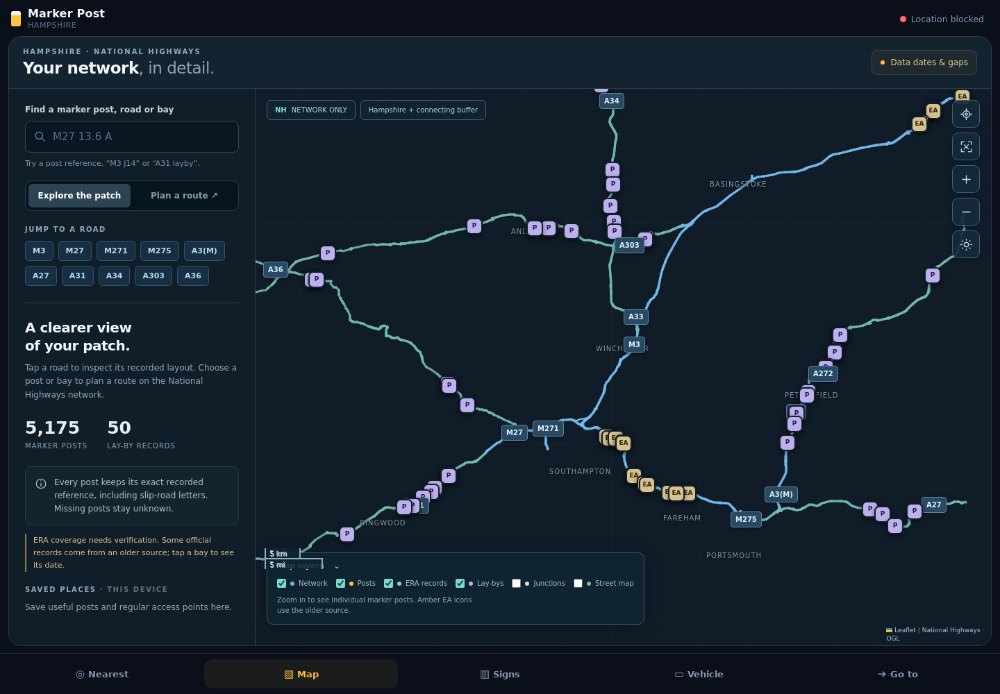
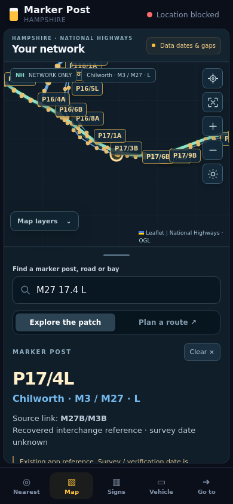

# Map verification — 24 September 2026

- 29/29 Node routing tests passed, including one-way travel, partial links, opposite carriageways, NT/MT turn restrictions, exact-node starts, no U-turns, no disconnected jumps and no lay-by through shortcuts.
- Official snapshot validator passed (complete geometry, dates, joins and routing eligibility).
- Browser checks passed at 1440×1000 and 390×844 with no JavaScript errors and no horizontal overflow on mobile.
- Confirmed 5,175 combined posts, recovered Chilworth search and explicit network-link selection, saved post reopening, and correctly classified ERA/lay-by icons.
- M27 10.0A → 40.0A produced an 18.6-mile network route; A31 2.0A → A34 2.0A also routed through the NH network. Reachable lay-by search returned routes from the selected start.
- Failed refresh retained a clearly labelled dated snapshot. An intentionally stale snapshot refused a route. A service-worker offline reload displayed the cached map and markers with an Offline snapshot label.
- Browser tests blocked external street tiles to avoid automated tile fetching; previews show the network-only background. Real GPS, actual street-tile delivery and field accuracy were not verified by browser tests.

